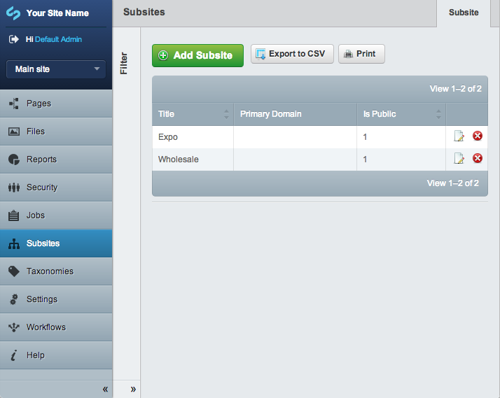

# Subsites Module

## Introduction

The subsites module provides a convenient way of running multiple websites from a single installation of SilverStripe,
sharing users, content, and assets between them - the sites will be managed from a single CMS.

A useful way to think of its use is where you have a business with a global headquarters and four branches in various
countries. The subsites module allows the five offices to use a single SilverStripe installation, and have information
from the headquarters flow down into the branches. The branches can hold information that is individual and the website
templates can also be different.

All separation of content achieved with this module should be viewed as cosmetic and not appropriate for
security-critical applications. The module gives some control over access rights especially in the "Pages" and "Files"
area of the CMS, but other sections' separation is much weaker: for example giving someone any of the "Roles and access
permissions" will imply that the person will likely be able to escalate his/her privileges to the global admin role.

For user documentation please see:

 1. [Setting up subsites](docs/en/set_up.md)
 1. [Working with subsites](docs/en/working_with.md)

## Features & limitations

### Features:

 * Each subsite appears as a standalone website from a users prospective
 * No need to duplicate existing code as all subsites use the same codebase as the main site
 * You can set individual permissions on each subsite domain name
 * Ability to copy a page and its content from the main site into a subsite
 * Create translations of subsite pages
 * Schedule the publishing of subsite pages
 * The database is shared between subsites (meaning duplicating content is easy)
 * When recovering from a disaster it's much easier to bring up a new copy of a single environment with 100 subsites than it is to bring up 100 environments.

### Limitations:

 * Each subsite domain name has to be set up on the server first, and DNS records need to be updated as appropriate.
 * A subsite cannot use a different codebase as the main site, they are intrinsically tied
 	* However, you can remove page types from a subsite when creating the subsite - [see the setup documentation for further details](set_up.md)
 * The only code a developer can edit between subsites is the theme
 * The separation between subsites in the CMS needs to be seen as cosmetic, and mostly applicable to the "Pages" and "Files" sections of the CMS.
 * All subsites run in the same process space and data set. Therefore if an outage affects one subsite it will affect all subsites, and if bad code or hardware corrupts one subsite's data, it's very likely that it has corrupted all subsite data. 
 	* This principle applies to application error, security vulnerabilities and high levels of traffic
 * It is not currently possible to backup or restore the data from a single subsite. 
 * It is awkward (but not impossible) to have separate teams of developers working on different subsites - primarily because of the level of collaboration needed. It is more suited to the same group of developers being responsible for all of the subsites.

If more isolation of code, security, or performance is needed, then consider running multiple separate installations (e.g. on separate servers).

## Requirements

*  SilverStripe 3.1

## Installation

*  Create necessary tables by visiting `http://<yoursite>/dev/build` (you should see a `Subsite` table created, among other things). You don't need to run this command for every subsite.
*  Login to the CMS as an administrator.  You should now see a "Subsites" entry on the main menu, access that section now.
*  Hit the "Add Subsite" button to create a new subsite.
*  Once you've created a subsite, you'll see a "Create Subsite Domain" button, hit that button to enter a domain or subdomain for your subsite. This will determine the URL of your website.  For example, if your site is running on `http://localhost/mysite`, and you set the subdomain to "subsite", then your subsite will be accessible on `http://subsite.localhost/mysite`
*  Go to the "Pages" section of the CMS.  In the top-left above the menu, you'll see a dropdown listing the two subsites - "Main site" is the original site that you had before you installed the subsites module.  Select your new subsite, and the site content tree will be changed.  It should be empty at this stage.
*  Add a page - change its title to "Home", and its URL Segment will be changed to "home".  Save the page.
*  Update your DNS and, if necessary, your webserver configuration, so that your subdomain will point to the SilverStripe installation on your webserver.  Visit this new subdomain.  You should see the new subsite homepage.

## Usage

### Strict Subdomain Matching ###

The module tries to provide sensible defaults, in which it regards `example.com` and `www.example.com` as the same domains. In case you want to distinguish between these variations, set `Subsite::$strict_subdomain_matching` to TRUE. This won't affect wildcard/asterisk checks, but removes the ambiguity about default subdomains.

### Permissions ###

Groups can be associated with one or more subsites, in which case the granted page- and asset-related permissions
only apply to this subsite.

Note that creating a Subsite-specific group, and giving it permissions unrelated to content editing and asset management
will result in members of this group being able to escalate their privileges. An example here is giving that group
"Full administrative rights" or some of the "Roles and access permissions", in which case it is possible for the member
of that group to simply add himself to the global "Administrators" group or change his own group to having access to all
sites.

The subsites module should be viewed as providing a convenience of visual separation for the sites on the interface
level, rather than a fully tight security model for managing many sites on the same CMS (it is still the same CMS).

### Access created domains

Once you have created some subsites/domains in your admin, you can check the overall functionality of subsites by

	http://your.primary-domain.com/subsite-metadata-url?SubsiteID=1

In some Browsers the SubsiteID is visible if you hover over the "Edit" link in the search results of Subsite admin.

### Subsite-specific themes

Download a second theme from http://www.silverstripe.com/themes/ and put it in your themes folder.  Open admin/subsites?flush=1 and select one of your subsites from the menu on the bottom-left.  You should see a Theme dropdown in the subsite details, and it should list both your original theme and the new theme.  Select the new theme in the dropdown.  Now, this subsite will use a different theme from the main site.

### Limit available themes for a subsite

Not all themes might be suitable or adapted for all subsites. You can optionally limit usage of themes:

*mysite/_config.php*

	:::php
	Subsite::set_allowed_themes(array('blackcandy','mytheme'));

### Enable Subsite support on DataObjects
To make your DataObject subsite aware, include a SubsiteID on your DataObject. eg:

*MyDataObject.php*

	:::php
	private static $has_one = array(
		'Subsite' => 'Subsite'
	);

Include the current SubsiteID as a hidden field on getCMSFields, or updateCMSFields. eg:

*MyDataObject.php*

	:::php
	public function getCMSFields() {
		$fields = parent::getCMSFields();
		if(class_exists('Subsite')){
			$fields->push(new HiddenField('SubsiteID','SubsiteID', Subsite::currentSubsiteID()));
		}
		return $fields;
	}

To limit your admin gridfields to the current Subsite records, you can do something like this:

*MyAdmin.php*

	:::php
	public function getEditForm($id = null, $fields = null){
		$form = parent::getEditForm($id, $fields);
		
		$gridField = $form->Fields()->fieldByName($this->sanitiseClassName($this->modelClass));
		if(class_exists('Subsite')){
			$list = $gridField->getList()->filter(array('SubsiteID'=>Subsite::currentSubsiteID()));
			$gridField->setList($list);
		}

		return $form;
	}

### Enable menu support for custom areas in subsites

Custom admin areas, by default, will not show in the menu of a subsite. Not all admins are adapted for or appropriate to show within a subsite. If your admin does have subsite support, or is intentionally global, you can enable the show in menu option either by applying:

*mysite/_config.php*

	:::php
	MyAdmin::add_extension('SubsiteMenuExtension');

or by defining the subsiteCMSShowInMenu function in your admin:

*MyAdmin.php*

	:::php
	public function subsiteCMSShowInMenu(){
		return true;
	}

### Public display of a subsite

By default, each subsite is available to the public (= not logged-in),
provided a correct host mapping is set up. A subsite can be marked as non-public
in its settings, in which case it only shows if a user with CMS permissions is logged in.
This is useful to create and check subsites on a live system before publishing them.

Please note that you need to filter for this manually in your own queries:

	$publicSubsites = DataObject::get(
		'Subsite',
		Subsite::$check_is_public ? '"IsPublic"=1' : '';
	);

To ensure the logged-in status of a member is carried across to subdomains,
you also need to configure PHP session cookies to be set
for all subdomains:

	// Example matching subsite1.example.org and www.example.org
	Session::set_cookie_domain('.example.org');

## Screenshots

