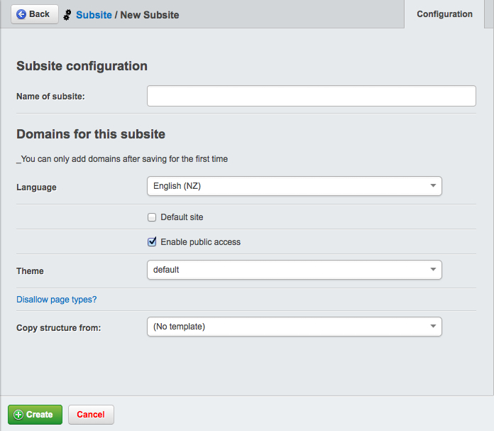
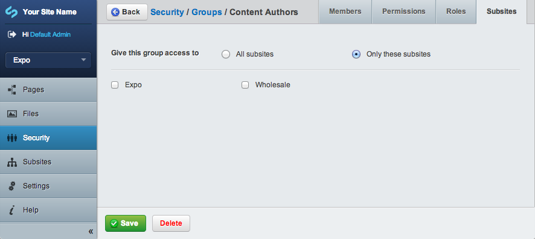
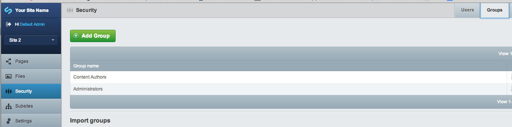
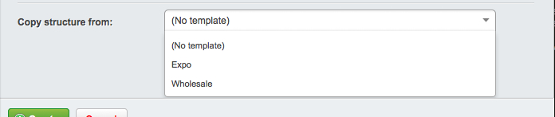
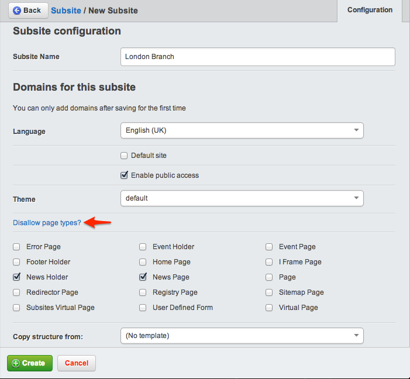
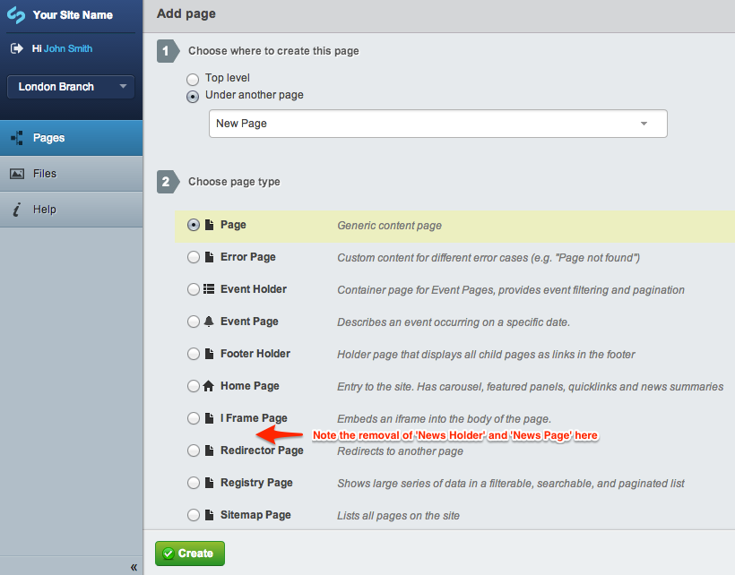

# Setting up

## Creating subsites

To view, edit and create subsites, go to the *Subsite* section of the CMS. Click *Search* to view a list of all existing subsites.

Click on a subsite name to edit its details. To create a new subsite, click *Add Subsite*. This opens the *Subsite configuration* subsection.

## Deleting a subsite

Click the red X to delete a subsite (you will be asked for confirmation.)

## Subsite configuration

You can configure the following details for a subsite:

 * *Name of subsite:* This is the display name for the site in the CMS (not public-facing)
 * *Domains for this subsite:* Lets you add one or more domains for this subsite, e.g., subsite.co.nz, subsite.org.nz, subsite.com
 * *Language:* Sets the language for the subsite. This affects the spellchecker (not the CMS interface language)
 * *Default site:* If your site is accessed by a domain not listed in any subsites, this subsite is shown as default.
 * *Enable public access:* Enables/disables the subsite. Corresponds to the *Active Subsite* column.
 * *Theme:* Shows the list of available themes that exist in the themes directory. The subsite will use the templates and styles from the selected theme.
 * *Disallow page types:* Lets you mark some page types to prevent them being used within this subsite (but not the main site). Clicking on that link will display a list of checkboxes for all of the page types which can be selected to disable that page type for the subsite you are editing. This is useful when you create a content editor and you do not want them to be able to add certain page types.
 * *Copy structure from:* Gives you the option to select an existing subsite from which to copy pages and files (see "Copying subsites" for more information about this)

## Roles

When creating roles, you can assign the following subsite-specific permissions:

 * *Access to 'Subsites' section:* Shows the *Subsite* section in the CMS, allowing you to manage subsites for your site (ie, create, edit, view.)
 * *Manage subsites for groups:* Ability to limit the permissions for a group to one or more subsites.
 * *Manage assets for subsites:* Ability to select the subsite to which an asset folder belongs (also requires access to *Files* section)

## Groups

Groups can have access to all sites, or to one or more specific subsites. If you have different staff in charge of each subsite, you probably want to [create](#creating-groups) a separate group for each subsite.

The dropdown in the upper left corner of the CMS indicates which subsite you are currently on. 

Once you make a selection from the dropdown, you see the appropriate groups in the *Security* section. In the Security section, click a group and go to its *Subsites* tab to assign the subsites to which the group has access. Click *Only
these subsites* to reveal a checklist of all available sites.

### Creating groups

Access to certain subsites can be limited to administrators based on the groups they are in.
So for example if you had a couple of subsites you could create a group for each subsite and then specify that the group had access to all subsites or just a specific subsites.

To access this functionality go to Security -> Groups

Select the group you want to modify and then go to the Subsites tab

## Copying subsites

Duplicating subsites can be useful if you want to create several subsites based on the same general site structure. You can set up a collection of pages, files, and images and use it as a template. When you create a new subsite, instead of starting from scratch you can copy it all from your existing subsite. This will copy all pages, files and images from that subsite into your new subsite.

To create a new subsite template, create a new subsite described above under "Creating subsites" but don't add any domains. Add a name that will make it easy to see that it is a template. Select the new template from the subsites dropdown in the upper right and create the pages and add the files and images you'd like to become part of the
template.

When you create a new subsite, you can now choose to Copy structure from your template. All your pages, files and images will be copied over to your new subsite.

## Page types
Page types refer to the type of pages that can be set up on a site. A page type will have certain features and functionality some examples on SilverStripe would be 'Page', 'HomePage' and 'ErrorPage' these all differ to each other in what they would be used for so you would use Page for any pages
underneath the HomePage.

You would only have one HomePage for your site and you may have some logic to only allow you to create one of these pages, ErrorPage would only be used for error pages and would be designed to be very minimal to work in situations where the site is experiencing difficulties (like no database access).

### Disable particular page types from a subsite

Sometimes, you will have two or more websites that are very similar, but have some small differences. For example, a head office and its 3 satellite offices may have 4 subsites, but only the head office site will have a "Company News" section on the site. In this instance, you can still use the subsites module, and use the 'Disallow page types' ability to remove certain page types from being created on subsites.

1. Create a new subsite as you normally would via the Subsites section in the CMS
2. Edit your new subsite.
3. At the bottom of the section, click on the link named "Disallow page types?" This will reveal a series of checkboxes containing all of the presently defined pagetypes in the CMS.
4. Select the page types that you wish to forbid from this subsite.
5. Click the Save button at the bottom of the section.

*Note:* This process is exactly the same when editing an existing subsite, you just select the subsite you want to remove page types from instead of creating a new subsite. Also you cannot not filter Page Types for the main site.

Now, whenever someone wants to create a new page on the subsite (the 'London Branch' subsite in this case), they will not be able to select the page types you've selected, as you can see below. Note that this restriction doesn't affect users or groups with "full administrative rights", and the blacklist will only apply to members of specified groups and users without this permission. Admins needs to login to the subsite domain directly (e.g. http://london.site.com/admin/, not http://site.com/admin). 

The page type blacklist applies only to future pages, not existing ones. If an administrator blacklists a defined page type on a subsite, existing pages of that type will remain on the subsite. The administrator (or another user) can later change it to a type that is not blacklisted after the page is published; however, once a user does that, that "grandfathered" pagetype will no longer be available to the published page.

For example, say a subsite user publishes a new Company Page before it was forbidden by an administrator. Later, a user with full administrative rights decides to disallow Company Pages from being created on the subsite. This restriction will only apply to all future pages that are published, but not to existing Company Pages. The full administrator (or any user with sufficient publishing rights) will have to manually convert any published Company Pages on the subsite to that of another allowed type.

## Themes
A theme is group of templates, images and CSS for the look of a website. When you are using Subsites you may have different themes installed for your site so you could apply different themes for each subsite.

## Assets 
Assets are files that have been uploaded via the CMS. It is suggested to use a naming convention for files designated to be used on a particular subsite or to create folders for each subsite to help organise them.