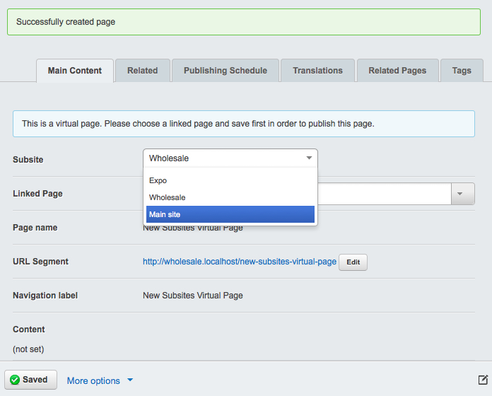

# Working with subsites

## Managing content across subsites

Select a subsite from the dropdown in the upper left to display the content for that site in the site tree.

## Subsites virtual pages

You can pull in the content from a page that resides on another subsite by creating a page of the type **Subsites
Virtual Page**. Pick the subsite from which you want to pull the content, then select the page. As with regular virtual
pages, your **Subsites Virtual Page** will display the content from the original page and get updated automatically if
the original content changes.

## Duplicating pages from the main site

If you have an existing page on the main site that you would like to copy to a subsite, all you need to do is:

 * Visit the page in the site tree and scroll down to the 'Copy page to subsite' dropdown
 * Choose the subsite you wish to copy the page to
 * Press the 'Copy' button

You will now be directed to the chosen subsite where the page will now be duplicated in the site tree